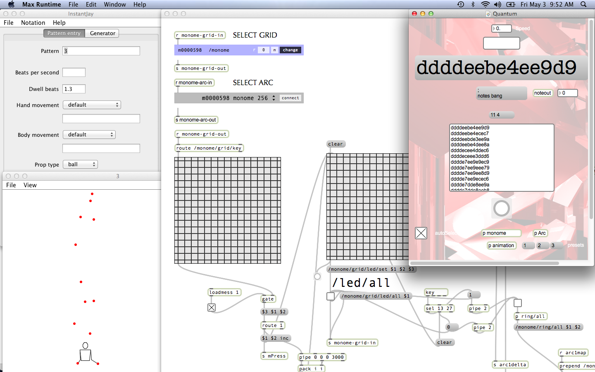

# quantum

"beat juggling"

generative sequencer for grid and arc based on siteswap, a form of juggling notation.

http://www.siteswap.org

designed by: jay gilligan

coded by: jusu

prefix: /monome

## concept

quantum maps arbitrary note values to objects in juggling patterns. higher notes correspond to higher throws by default, but any value can be assigned. additionally, the program allows for a distinction between the left and right hands. note triggers are set to the peak of each object, rather than the traditional catching or throwing position. this produces unexpected rhythmic variations, and allows for chords to exist.

## getting started

quantum was built upon juggling lab, a juggling pattern animator by jack boyce- http://jugglinglab.sourceforge.net

first open the "juggling lab.jar" file included in the quantum patch folder. this should start by showing a three ball animation. next open the "quantum.maxpat" and notes should now be heard. midi destination can be set by double clicking the "noteout" button, and velocity can be set next to that. note presets can be edited by clicking the "notes bang" button. there are up to 8 presets which can be saved.

siteswaps may be manually entered into the small white box below the speed control (and above the large grey bar). to run a valid siteswap, click on this box, enter the values, and then click anywhere outside the box. the siteswap should now be animated in juggling lab and displayed prominently in the quantum patch, with the resulting melody being heard. 

juggling lab also makes an excellent online siteswap generator. use this program to find valid strings of numbers to enter and see what they sound like. please note that values higher than 9 are written with letters in the final sequence: 123456789abcdefghi...

http://jugglinglab.sourceforge.net/bin/example_gen.html

## grid

connect the grid by double clicking the "p monome" button on the quantum patch. this will open a new window where you may connect your grid (and arc). once connected, the siteswap animation should be displayed on the grid. 

button presses will display previously entered lists of siteswaps. the default layout (with cable orientation to the left) programs the grid in a matrix- starting at the bottom, each row represents a progressively higher throw. starting from the left, each column represents a longer siteswap period (period = number of throws in each pattern). the file included with the patch starts in the lower left hand corner with the maximum throw height of 3 and longest period of 3. it stretches to the top right hand corner, ending with the highest throw of 18 (or the letter "i" in siteswap), and the longest period of 18.

without an arc to supplement functionality, only the first pattern under each button press will be accessible. however, each button has the potential to store up to 32 patterns at one time. the grid may be reprogrammed by clicking in the largest white box on the quantum patch. many siteswaps may be entered at one time, separated by a line break (press return after each complete siteswap entered). then click anywhere outside the box to save these patterns to the "patterns.json" file included with the patch. these patterns will be recalled each time you push the same button on the grid. press a new button on the grid to add patterns there. without an arc, the best layout will be to find your favorite siteswaps and enter them separately under one button each, filling the grid for fast retrieval. 

the grid size and animation options can be found by double clicking on the "p animation" button in the quantum patch. once this new window opens, double click "js animationTail.js" which should open yet another window. while originally designed for a 256, other grid sizes can be entered by changing the value "16" in line 9 and 10. grids with varibrightness can opt to have a small tail or fading trail on the animated objects. replace line 5 with:

	var ramp = [0, 1, 1, 2,  2, 3, 3, 3,  4, 4, 5, 6,  6, 8, 11, 15];

## arc

an arc may be connected at the same time as a grid. after a button press on the grid, the first encoder will light up in segments showing how many different siteswaps are stored under that button. rotate the first encoder to change focus on different siteswaps and then press the encoder to select that siteswap. 

the second encoder can be rotated clockwise to increase the tempo. pushing the second encoder will change the siteswap to "2," effectively stopping all action. at the moment only push button arcs are supported. 

## known issues/wish list

- due to an error in the initial design, throw values of "g," "h," and "i" do not produce any sounds at the moment even though they are included in the programmed matrix of saved siteswaps on the 256. this can be easily fixed by adding the capacity for note values to these throws in the already existing system.

- because of how juggling lab deals with its animation, and how this animation is mapped to note values in the quantum patch, throws "0," "1," and "2" do not yet produce any sounds. this is a conceptual error, where only "0" should represent a rest in musical notation and produce a beat of silence. hopefully future releases of this patch will add musical functionality to throws of "1" and "2".

- if the siteswap "2" eventually triggers a note, the second encoder push button function will need to be rewritten as a "panic button" (clearing the animation on the grid and stopping all sounds) because now it defaults to "2" when pressed.

- scrolling animation around the arc's first encoder can be a bit choppy/tricky and as well the division of segments can sometimes be unequal depending on the number of siteswaps to be displayed.

- the tempo control of the second encoder is not mapped in any meaningful way to bpm. fundamentally this probably cannot be fixed because of the way the juggling lab animation handles time, but perhaps there could be led's pre-lit around the second encoder that correspond to certain tempos, i.e. 60 bpm, 90 bpm, etc., once those calibrations have been manually noted.

- arcs without push button functionality could easily be implemented by eliminating the need to push the first encoder after rotating it to select the desired siteswap segment. perhaps as soon as the encoder is turned and its in the "zone" of a new segment, that siteswap could play as long as the encoder stays in that zone. as well, the second encoder could simply turn the tempo down to zero, which could also be linked to clearing the animation?

- at the moment the quantum patch can only play the melody of asynchronous siteswaps. however, juggling lab can animate synchronous siteswaps, and the grid has no problem displaying these animations. slightly related, juggling lab animates each pattern in full 3D, allowing users to click on the animation and rotate it at will. these changes can also be seen perfectly on the grid, but with no musical effect. perhaps one day quantum can be programmed to play synchronous siteswaps and rotation of the animation can be mapped to musical consequences. 

## download
  * latest version can be found here: https://github.com/jusu/Quantum/archive/master.zip
  * quantum source files: https://github.com/jusu/Quantum/
  * quantum juggling lab mod files: https://github.com/jusu/JugglingLab-Quantum

## media/discussion
  * https://vimeo.com/62206145
  * https://vimeo.com/65731437